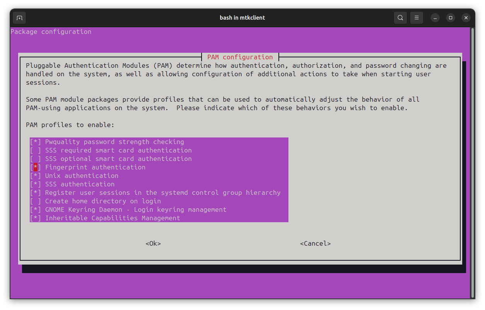

# ELAN7001 / eFSA80SC (04f3:3104) fingerprint reader on Linux

Working, secure fingerprint authentication for the ELAN SPI fingerprint sensor
with **touchpad PID `04f3:3104`** (ACPI `ELAN7001`, sensor `eFSA80SC`, 80×80) —
the one found in the **ASUS VivoBook X513EAN / S513EA** and relatives.

Out of the box this sensor does nothing on Linux. With the steps below you get
`fprintd` enrollment **and reliable verification**, wired into login / sudo /
lock-screen via PAM.

> **Status on my hardware (ASUS VivoBook X513EAN):** enrollment clean,
> **5/5 genuine verifies accepted, 0/3 impostor (wrong-finger) attempts
> accepted**, running live for `sudo` and the GNOME lock screen with the
> password path intact as fallback.

---

## Why this repo exists

`04f3:3104` was reported as unsupported / crashing (upstream
[mincrmatt12/elan-spi-fingerprint#13](https://github.com/mincrmatt12/elan-spi-fingerprint/issues/13)).
Two things were wrong, and the second one is the interesting part:

1. **Capture** needed a small driver fix (wrong quirk flag for this PID).
2. **Matching** genuinely does not work with libfprint's built-in NBIS/bozorth3
   matcher on this sensor — not "needs tuning", it *cannot discriminate
   fingers* on the narrow swipe strips these sensors produce. Measured:
   genuine and impostor match-score distributions **fully overlap**. Full data
   and reasoning in [`docs/MATCHING-ANALYSIS.md`](docs/MATCHING-ANALYSIS.md).

The fix for (2) is to swap in **[SIGFM](https://github.com/goodix-fp-linux-dev/sigfm)**
("SIFT Is Good For Matching"), a SIFT-based matcher the
[goodix-fp-linux-dev](https://github.com/goodix-fp-linux-dev) community built for
small low-resolution sensors. On the same captures, SIGFM separates genuine from
impostor by **2–5 orders of magnitude** (impostor pairs score ≤ 7, genuine pairs
549–5,400,000).

---

## Does this apply to me?

Run:

```bash
ls /sys/bus/spi/devices/ | grep -i elan
```

If you see `spi-ELAN7001:00` (or similar) you have an SPI ELAN sensor. To confirm
the exact PID:

```bash
# touchpad PID — look for 04F3:XXXX
grep -i '^HID_ID' /sys/bus/hid/devices/*/uevent 2>/dev/null | grep -i 04F3
```

This guide is written and tested for **`04f3:3104` / `eFSA80SC`**. Other ELAN SPI
PIDs (`3057`, `30c6`, `3087`, …) are handled by the upstream
[`mincrmatt12`](https://github.com/mincrmatt12/elan-spi-fingerprint) driver and
may already work with plain NBIS. The SIGFM swap here helps any of these small
`eFSA80SC`-class sensors where verification is unreliable.

---

## Prerequisites

Ubuntu/Debian package names (adjust for your distro):

```bash
sudo apt install \
  git meson ninja-build build-essential pkg-config \
  libglib2.0-dev libgusb-dev libgudev-1.0-dev libpixman-1-dev \
  libnss3-dev libpolkit-gobject-1-dev libsystemd-dev \
  libopencv-dev libdoctest-dev \
  fprintd libpam-fprintd
```

`libopencv-dev` and `libdoctest-dev` are the extra bits SIGFM needs on top of a
normal libfprint build. Kernel **≥ 4.20** is required for the udev-based spidev
binding used below (any current distro is fine).

---

## Step 1 — Kernel / spidev setup

The sensor talks over SPI through the generic `spidev` driver. Two config files
(both in [`system/`](system/)):

```bash
# 1. bind ELAN7001 to spidev
sudo cp system/99-elan-spi.rules /etc/udev/rules.d/

# 2. give your user access to the device nodes
sudo cp system/99-fingerprint-perms.rules /etc/udev/rules.d/

# 3. enlarge the spidev transfer buffer (eFSA80SC needs this or frames corrupt)
sudo cp system/increase-spidev.conf /etc/modprobe.d/

# apply without rebooting
sudo modprobe spidev
sudo udevadm control --reload-rules && sudo udevadm trigger
```

Verify the device node now exists:

```bash
ls -l /dev/spidev0.0
cat /sys/module/spidev/parameters/bufsiz   # should print 32768
```

If `/dev/spidev0.0` is missing, your kernel bound the SPI device to something
else; unbind it or check the ACPI id matches the udev rule.

---

## Step 2 — Build patched libfprint (SIGFM + this PID)

We build the goodix community libfprint fork (which contains SIGFM) with a small
patch that (a) adds the `0x3104` device entry, (b) fixes the capture pipeline for
this sensor, and (c) selects SIGFM as the matcher for the elanspi driver.

```bash
git clone https://github.com/goodix-fp-linux-dev/libfprint.git
cd libfprint
git checkout sigfm
# base tested against this commit:
git checkout 07306bbc9256942595e31fb0f407b364ffa24d07

# apply the patch from this repo (adjust the path)
git apply /path/to/this-repo/patches/elanspi-3104-sigfm.patch
```

What the patch changes (all in `libfprint/drivers/elanspi.{c,h}`):

- Adds the `04f3:3104` entry to the device table (`ELANSPI_90RIGHT_ROTATE`, and
  **not** the `X571` quirk — this PID uses the standard transfer format; with
  X571 set, calibration times out).
- Drops the `2×` `fpi_image_resize` — the native ~10 px ridge period is already
  ideal; upscaling only starves feature extraction.
- Drops the `FPI_IMAGE_PARTIAL` flag — on a 120 px-wide strip it culls 70–85 % of
  features as "perimeter".
- Adds a light Gaussian smoothing pass (σ≈1.2) to kill sensor-noise speckle.
- Sets `img_class->algorithm = FPI_DEVICE_ALGO_SIGFM` and a verify threshold of
  100.

Build and install into `/usr/local` (kept separate from your distro's libfprint):

```bash
meson setup build --prefix=/usr/local -Ddrivers=elanspi -Dudev_rules=disabled -Ddoc=false
ninja -C build
sudo ninja -C build install
sudo ldconfig
```

> **Note on pkg-config:** if you have Linuxbrew or another pkg-config ahead of the
> system one, prefix the meson/ninja commands with
> `PKG_CONFIG_PATH=/usr/lib/x86_64-linux-gnu/pkgconfig:/usr/share/pkgconfig`.

This installs `/usr/local/lib/.../libfprint-2.so.2`, which `ldconfig` makes the
system default over the distro copy in `/usr/lib`. `fprintd` will now load it.
(Runtime dependency: the OpenCV shared libraries from `libopencv-dev` must stay
installed.)

Restart the daemon:

```bash
sudo systemctl restart fprintd
```

---

## Step 3 — Enroll and verify

```bash
fprintd-enroll -f right-index-finger    # swipe slowly, ~8 times
for i in 1 2 3; do fprintd-verify; done # should say verify-match
```

Swipe technique matters a little: a slow, even swipe from the top edge of the
sensor works best. If a swipe is too fast you'll get `verify-swipe-too-short` —
just try again.

**Sanity-check security:** enroll one finger, then run `fprintd-verify` and swipe
a *different* finger — it must report `verify-no-match`. (It does on my hardware,
0/3.)

---

## Step 4 — Enable for login / sudo / lock screen (PAM)

```bash
sudo pam-auth-update
```

In the menu, tick **"Fingerprint authentication"**. **Leave "Unix
authentication" ticked** — that is your password fallback; never remove it.
Tab to `<Ok>`, Enter.



Test it without risking a lockout — keep your current terminal open and, in a new
one:

```bash
sudo -k
sudo echo it-works    # prompts: "Swipe your right index finger..."
```

The GNOME/KDE lock screen and login will now offer fingerprint too. If a swipe
fails, pressing Enter/Escape falls back to the password prompt as normal.

---

## Troubleshooting

| Symptom | Fix |
|---|---|
| `/dev/spidev0.0` missing | udev rule didn't bind; check `ls /sys/bus/spi/devices/` for the ELAN id and that it matches the rule |
| Capture times out during calibrate | you still have the `X571` quirk — make sure you applied the patch (it removes it for `0x3104`) |
| `fprintd-verify` always `verify-no-match` | you're on stock libfprint/NBIS, not the SIGFM build — check `ldconfig -p \| grep libfprint-2` points at `/usr/local` |
| Frames corrupt / detection flaky | `spidev.bufsiz` not applied — `cat /sys/module/spidev/parameters/bufsiz` must be `32768`, then re-`modprobe` |
| Works, then breaks after a system update | a distro libfprint/fprintd update may shadow or ABI-break the local build — rebuild Step 2 |

---

## How it works / the investigation

[`docs/MATCHING-ANALYSIS.md`](docs/MATCHING-ANALYSIS.md) has the full write-up:
why NBIS/bozorth3 fails on these strips (with measured genuine/impostor score
matrices), and why SIGFM succeeds.

Two small diagnostic tools used to get there are in [`tools/`](tools/), meant to
be dropped into the libfprint source tree:

- `minutiae-dump.c` — capture one image through the real driver path and dump the
  image + detected NBIS minutiae (counts, positions, binarized image).
- `offline-match.c` — run the exact fprintd minutiae→bozorth3 pipeline on saved
  `.pgm` captures and print raw scores, so you can measure matching offline
  without swiping for every experiment.

---

## Credits

- [**mincrmatt12/elan-spi-fingerprint**](https://github.com/mincrmatt12/elan-spi-fingerprint)
  and the `mincrmatt12/libfprint` `elanspi` driver — the entire SPI reverse
  engineering and the base driver this builds on.
- [**goodix-fp-linux-dev**](https://github.com/goodix-fp-linux-dev) — the SIGFM
  matcher and the libfprint fork that integrates it. SIGFM turned out to work
  beautifully on ELAN sensors too, not just Goodix.
- [**libfprint**](https://gitlab.freedesktop.org/libfprint/libfprint) upstream.

## License

The patch and the tools derive from libfprint and are distributed under the
**LGPL-2.1-or-later**, matching libfprint. See [`LICENSE`](LICENSE).

The fingerprint images used during the investigation were of my own fingers and
are **not** included in this repository (biometric data). Generate your own with
the tools if you want to experiment.
